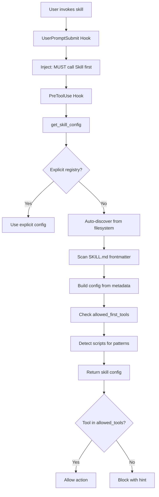

# skill-guard


**Python Library: Universal skill auto-discovery and enforcement for Claude Code hooks**

> **⚠️ IMPORTANT**: This is a **Python library**, NOT a user-facing skill. You cannot invoke `/skill-guard` as a command. This package is used **internally by Claude Code hooks** to auto-discover and enforce skill execution patterns.

Automatically discovers and enforces **ALL skills** without manual registration, replacing manual `SKILL_EXECUTION_REGISTRY` with dynamic discovery from filesystem.

## 📚 What This Is

**This is NOT a Claude skill** - it's a Python library that hooks import:

```python
# In your hooks:
from skill_guard import discover_all_skills, get_skill_config
```

**What it does:**
- Auto-discovers all skills from `.claude/skills/*/SKILL.md` frontmatter
- Enforces skill execution patterns (via PreToolUse hooks)
- Provides script pattern detection for skill gate enforcement

**What it does NOT do:**
- ❌ You cannot invoke `/skill-guard` as a command
- ❌ There's no user-facing interface
- ❌ It's purely a backend library for hooks

- 🔍 **Zero-Maintenance Auto-Discovery**: Scans `.claude/skills/*/SKILL.md` frontmatter automatically
- 🔒 **Dual-Layer Enforcement**: UserPromptSubmit + PreToolUse hooks cooperate to enforce workflows
- 🎯 **Script Pattern Detection**: Auto-detects scripts in `scripts/` directories for pattern matching
- 📚 **Knowledge Skill Exemption**: Distinguishes execution skills (enforced) from reference skills (not enforced)
- 🔄 **Backwards Compatible**: Explicit registry takes precedence over auto-discovery
- ⚡ **Fast**: Discovers 184+ skills in milliseconds

## 📦 Installation

### For Hook Developers (Dev Mode)

skill-guard is a Python library dependency used by hooks. Install once:

```bash
cd P:/packages/skill-guard
pip install -e .
```

Then import in your hooks:

```python
from skill_guard import discover_all_skills, get_skill_config
```

### For End Users

**No action required.** skill-guard is a backend library used by hooks, not a user-facing package. End users benefit from skill enforcement automatically without installing anything directly.

## 🚀 Quick Start

### Usage in Hooks

```python
# In your PreToolUse or UserPromptSubmit hooks:
from skill_guard import discover_all_skills, get_skill_config

# Discover all skills automatically
skills = discover_all_skills()
print(f"Discovered {len(skills)} skills")

# Get skill configuration with auto-discovery fallback
config = get_skill_config("my-skill", {})
print(f"Tools: {config.get('tools')}")
print(f"Pattern: {config.get('pattern')}")
```

**That's it!** No skill invocation, no junctions, no Claude discovery needed. It's just a Python package that hooks import.

## 🔧 Development (Windows)

### Setup

```powershell
# Navigate to package
cd P:/packages/skill-guard

# Install as editable Python package
pip install -e .

# That's it! No junctions or Claude discovery needed.
```

### Development Workflow

```powershell
# Edit Python code
vim src/skill_guard/module.py

# Run tests
pytest

# Format code
ruff check src/ tests/
ruff format --check src/ tests/

# Install changes
pip install -e .
```

## 📖 How It Works

### Architecture



### Configuration Sources (Priority Order)

1. **Explicit Registry**: Manual `SKILL_EXECUTION_REGISTRY` (backwards compatibility)
2. **Frontmatter**: `allowed_first_tools` field in SKILL.md
3. **Script Detection**: Auto-detects `scripts/*.py` for pattern matching
4. **Category Defaults**: Sensible defaults based on skill category

### Knowledge Skills Exemption

Reference/documentation skills are automatically exempt from enforcement:

```python
KNOWLEDGE_SKILLS = {
    "standards", "constraints", "techniques", "evidence-tiers",
    "constitutional-patterns", "cognitive-frameworks", "prompt_refiner",
    "library-first", "solo-dev-authority", "data-safety-vcs",
    "search", "cks", "analyze", "discover", "ask",
}
```

## 📊 API Reference

### `discover_all_skills()`

Auto-discover ALL skills from `.claude/skills/*/SKILL.md`.

**Returns:**
```python
{
    "skill_name": {
        "name": "skill_name",
        "category": "development",
        "has_execution": True,
        "allowed_first_tools": ["Bash"],
        "default_tools": ["Bash"],
    }
}
```

### `get_skill_config(skill_name, explicit_registry)`

Get skill configuration with fallback to auto-discovery.

**Parameters:**
- `skill_name` (str): Name of the skill (without slash)
- `explicit_registry` (dict | None): Optional explicit SKILL_EXECUTION_REGISTRY

**Returns:**
```python
{
    "tools": ["Bash"],
    "pattern": "run_heavy.py",
    "hint": "Use /skill via its documented workflow",
    "intent_enabled": False,
    "discovered": True,  # Auto-discovered flag
}
```

## 🧪 Testing

```bash
# Run all tests
pytest

# Run with coverage
pytest --cov=src/skill_guard --cov-report=html

# Run specific test
pytest tests/test_auto_discovery_integration.py -v
```

## 🤝 Contributing

Contributions welcome! Please see [CONTRIBUTING.md](CONTRIBUTING.md).

## 📄 License

MIT License - see [LICENSE](LICENSE) file.

## 🔗 Links

- [Documentation](https://github.com/yourusername/skill-guard#readme)
- [Issue Tracker](https://github.com/yourusername/skill-guard/issues)
- [Release Notes](CHANGELOG.md)

## 🎯 Use Cases

- **Claude Code Hook Development**: Enforce skill execution patterns
- **Multi-Agent Systems**: Auto-discover agent capabilities
- **Plugin Systems**: Dynamic plugin registration
- **Workflow Automation**: Enforce execution patterns

## 💡 Design Philosophy

**Principles:**
1. **Zero Maintenance**: Auto-discovery eliminates manual registry updates
2. **Backwards Compatible**: Explicit registry still works
3. **Fail Open**: Unknown skills don't block execution
4. **Explicit First**: Frontmatter beats automatic detection

**What Makes This Unique:**
- Universal filesystem-based auto-discovery (novel approach)
- Automatic script pattern detection
- Dual-layer enforcement (UserPromptSubmit + PreToolUse)
- Knowledge skill categorization
- Self-registering from frontmatter

---

**Note**: This package is part of the CSF NIP ecosystem and requires Claude Code hooks to function properly.
