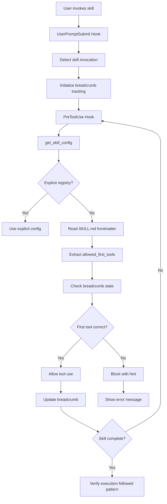

# skill-guard


**Python Library: Skill execution enforcement with breadcrumb-based verification**

> **⚠️ IMPORTANT**: This is a **Python library**, NOT a user-facing skill. You cannot invoke `/skill-guard` as a command. This package is used **internally by Claude Code hooks** to enforce skill execution patterns when users invoke skills.

Enforces skill execution patterns through breadcrumb tracking, ensuring skills follow their documented workflows and providing self-verification.

## 📚 What This Is

**This is NOT a Claude skill** - it's a Python library that hooks import:

```python
# In your hooks:
from skill_guard import discover_all_skills, get_skill_config
```

**What it does:**
- Enforces skill execution patterns when users invoke skills (e.g., `/package`, `/gto`)
- Uses breadcrumb system to track skill execution steps
- Verifies skills follow their documented workflows
- Provides self-verification capabilities for skills

**What it does NOT do:**
- ❌ You cannot invoke `/skill-guard` as a command
- ❌ There's no user-facing interface
- ❌ It's purely a backend library for hooks

- 🔒 **Execution Enforcement**: Ensures skills are invoked via their documented patterns
- 🍞 **Breadcrumb Tracking**: Monitors skill execution flow step-by-step
- ✅ **Self-Verification**: Helps skills verify they're working as intended
- 📚 **Knowledge Skill Exemption**: Distinguishes execution skills (enforced) from reference skills (not enforced)
- 🔄 **Backwards Compatible**: Works with explicit SKILL_EXECUTION_REGISTRY
- ⚡ **Fast**: Validates skill execution in milliseconds

## 📦 Installation

### For Hook Developers (Dev Mode)

skill-guard is a Python library dependency used by hooks. Install once:

```bash
cd P:/packages/skill-guard
pip install -e .
```

Then import in your hooks:

```python
from skill_guard import discover_all_skills, get_skill_config
```

### For End Users

**No action required.** skill-guard is a backend library used by hooks, not a user-facing package. End users benefit from skill enforcement automatically without installing anything directly.

## 🚀 Quick Start

### Usage in Hooks

```python
# In your PreToolUse or UserPromptSubmit hooks:
from skill_guard import discover_all_skills, get_skill_config

# When a user invokes a skill (e.g., /package skill-guard):
# 1. UserPromptSubmit hook detects skill invocation
# 2. PreToolUse hook enforces execution pattern

# Get skill configuration for enforcement
config = get_skill_config("package", {})
print(f"First tool must be: {config.get('tools')}")  # e.g., ["Skill"]
print(f"Expected pattern: {config.get('pattern')}")    # e.g., call Skill first
```

**How it works:**
1. User types `/package skill-guard`
2. UserPromptSubmit hook detects skill invocation
3. PreToolUse hook enforces first tool must be `Skill`
4. Breadcrumb system tracks execution steps
5. Skill self-verifies it's following documented workflow

## 🔧 Development (Windows)

### Setup

```powershell
# Navigate to package
cd P:/packages/skill-guard

# Install as editable Python package
pip install -e .

# That's it! No junctions or Claude discovery needed.
```

### Development Workflow

```powershell
# Edit Python code
vim src/skill_guard/module.py

# Run tests
pytest

# Format code
ruff check src/ tests/
ruff format --check src/ tests/

# Install changes
pip install -e .
```

## 📖 How It Works

### Architecture



### Execution Flow

1. **User invokes skill**: User types `/package skill-guard`
2. **Breadcrumb initialization**: Tracking begins from skill invocation
3. **Tool enforcement**: PreToolUse hook checks if `Skill` tool called first
4. **Pattern verification**: Breadcrumb system tracks each step
5. **Self-verification**: Skill can verify it followed documented workflow

### Configuration Sources (Priority Order)

1. **Explicit Registry**: Manual `SKILL_EXECUTION_REGISTRY` (backwards compatibility)
2. **Frontmatter**: `allowed_first_tools` field in SKILL.md
3. **Script Detection**: Auto-detects `scripts/*.py` for pattern matching
4. **Category Defaults**: Sensible defaults based on skill category

### SKILL.md Frontmatter Schema

Skills can declare their execution requirements in SKILL.md frontmatter:

```yaml
---
name: my-skill
category: development
allowed_first_tools:
  - Bash
workflow_steps:
  - detect
  - analyze
  - generate
  - verify
enforcement_level: STANDARD
---
```

**Supported fields:**

- **allowed_first_tools**: List of tools that must be called first when invoking this skill
- **workflow_steps**: List of step names that will be tracked by breadcrumb system
- **enforcement_level**: Verification strictness (optional, defaults to STANDARD)

**Enforcement Levels:**

1. **MINIMAL** - Fastest, least friction
   - Checks: Session duration > 10s, tools used ≥ 2
   - Use case: Simple skills where workflow steps aren't critical
   - Example: Quick refactoring skills

2. **STANDARD** (default) - Balanced verification
   - Checks: MINIMAL + ≥2 workflow phases + verification step
   - Use case: Most skills where structured workflow matters
   - Example: Code review, feature development

3. **STRICT** - Maximum verification
   - Checks: ALL workflow_steps must complete
   - Use case: Critical skills where nothing can be skipped
   - Example: Deployment, migration

**Global override:** Set `BREADCRUMB_ENFORCEMENT_LEVEL` environment variable to override all skills.

### Knowledge Skills Exemption

Reference/documentation skills are automatically exempt from enforcement:

```python
KNOWLEDGE_SKILLS = {
    "standards", "constraints", "techniques", "evidence-tiers",
    "constitutional-patterns", "cognitive-frameworks", "prompt_refiner",
    "library-first", "solo-dev-authority", "data-safety-vcs",
    "search", "cks", "analyze", "discover", "ask",
}
```

## 📊 API Reference

### `discover_all_skills()`

Auto-discover ALL skills from `.claude/skills/*/SKILL.md`.

**Returns:**
```python
{
    "skill_name": {
        "name": "skill_name",
        "category": "development",
        "has_execution": True,
        "allowed_first_tools": ["Bash"],
        "default_tools": ["Bash"],
    }
}
```

### `get_skill_config(skill_name, explicit_registry)`

Get skill configuration with fallback to auto-discovery.

**Parameters:**
- `skill_name` (str): Name of the skill (without slash)
- `explicit_registry` (dict | None): Optional explicit SKILL_EXECUTION_REGISTRY

**Returns:**
```python
{
    "tools": ["Bash"],
    "pattern": "run_heavy.py",
    "hint": "Use /skill via its documented workflow",
    "intent_enabled": False,
    "discovered": True,  # Auto-discovered flag
}
```

## 🧪 Testing

```bash
# Run all tests
pytest

# Run with coverage
pytest --cov=src/skill_guard --cov-report=html

# Run specific test
pytest tests/test_auto_discovery_integration.py -v
```

## 🤝 Contributing

Contributions welcome! Please see [CONTRIBUTING.md](CONTRIBUTING.md).

## 📄 License

MIT License - see [LICENSE](LICENSE) file.

## 🔗 Links

- [Documentation](https://github.com/yourusername/skill-guard#readme)
- [Issue Tracker](https://github.com/yourusername/skill-guard/issues)
- [Release Notes](CHANGELOG.md)

## 🎯 Use Cases

- **Skill Execution Enforcement**: Ensure skills are invoked via their documented patterns
- **Breadcrumb Tracking**: Monitor skill execution flow step-by-step
- **Self-Verification**: Help skills verify they're working as intended
- **Workflow Compliance**: Ensure skills follow their documented workflows

## 💡 Design Philosophy

**Principles:**
1. **Enforcement over Discovery**: Focus on ensuring correct skill usage, not just finding skills
2. **Breadcrumb-Based**: Track execution flow for verification and debugging
3. **Backwards Compatible**: Explicit SKILL_EXECUTION_REGISTRY still works
4. **Fail Clear**: Provide helpful error messages when enforcement blocks execution
5. **Explicit First**: Frontmatter declarations beat automatic detection

**What Makes This Unique:**
- Breadcrumb-based execution tracking (novel approach)
- Integration between UserPromptSubmit and PreToolUse hooks
- Self-verification capabilities for skills
- Knowledge skill categorization for selective enforcement

---

**Note**: This package is part of the CSF NIP ecosystem and requires Claude Code hooks to function properly.
